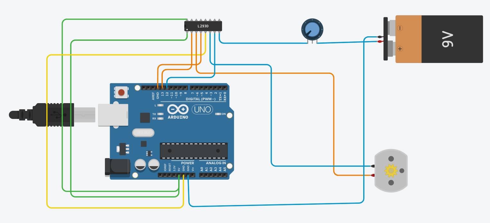
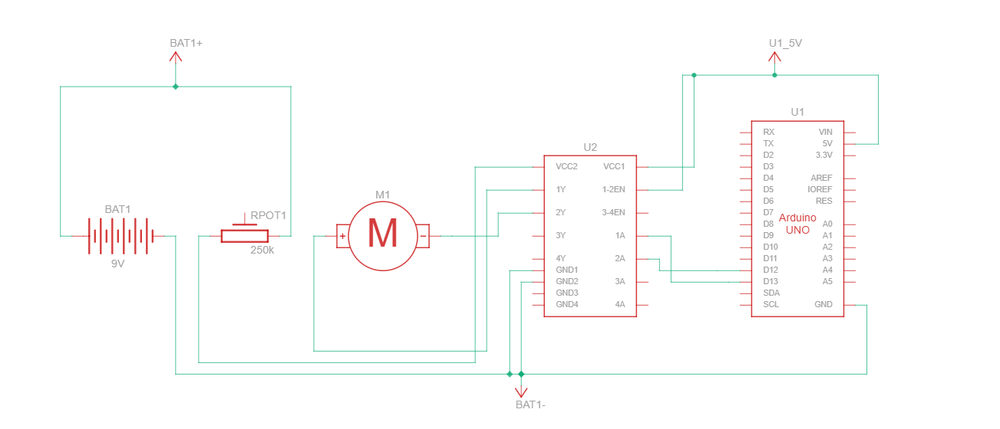
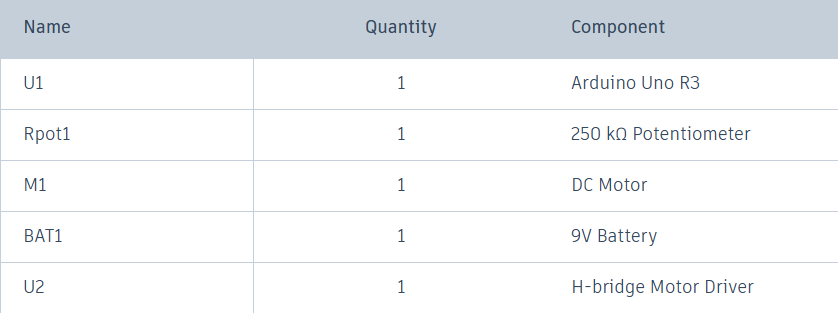
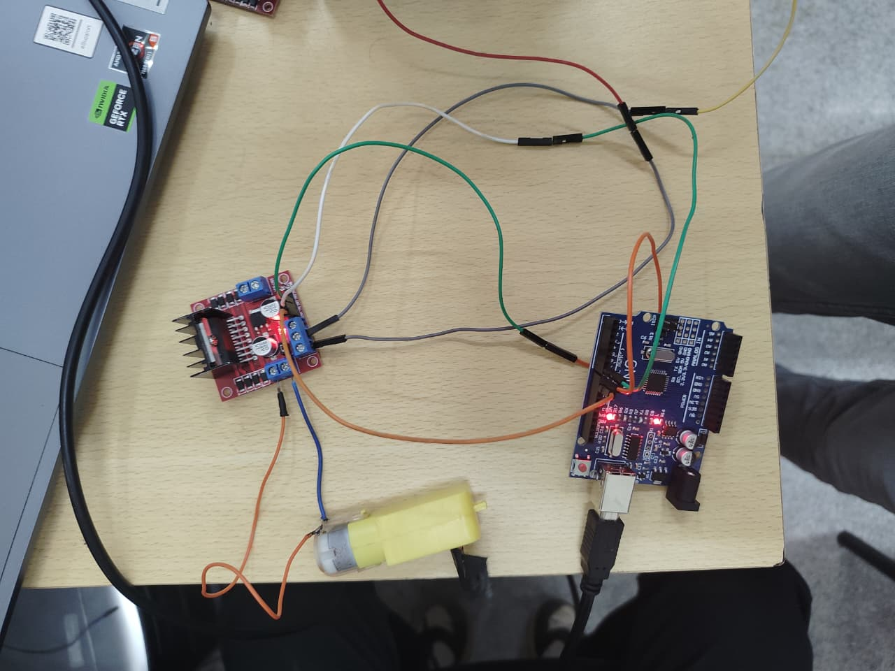
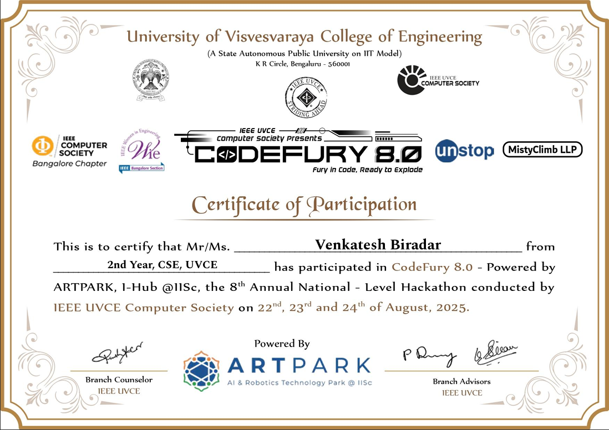
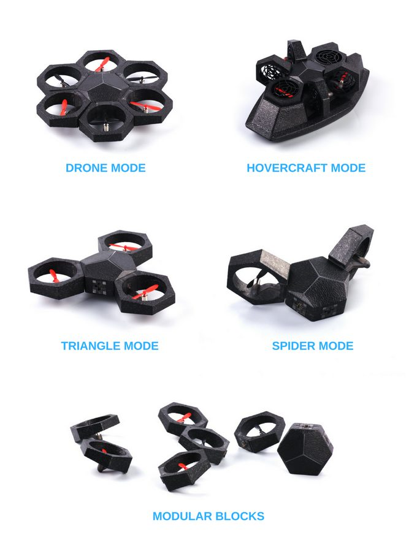
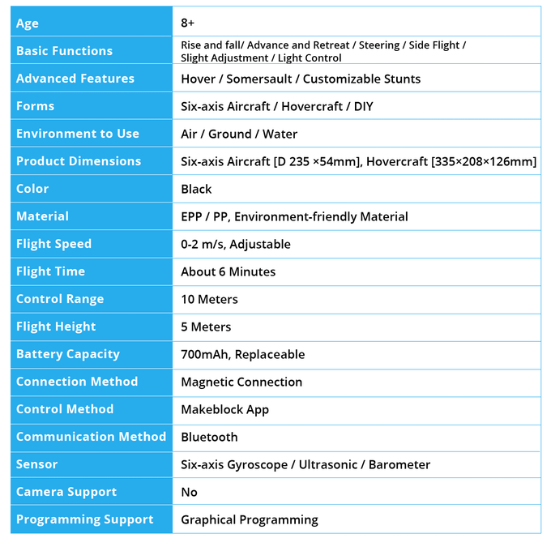

# **TASK 1: 3D Printing**

**Objective:** To understand the working of a 3D printer, its components, about STL(Stereolithography) file and also about how we slice the and print the model from stl file .

---

### **Outcomes and Learnings:**

I learned the following things:

**1. The Working Principle (FDM):**
I learned that the most common type of 3D printing is Fused Deposition Modeling (FDM). In this type of printing plastic material is melted and put out through a nozzle, which moves along all three axes (X, Y, and Z axes) and this finally results in the formation of the 3d model.

**2. Key Components of an FDM Printer:**
* **Filament:** This is the raw material, typically a plastic thread. The most common filament for beginners is PLA (Polylactic Acid).
* **Extruder:** The "hot end" of the printer that pulls in the filament, melts it to a specific temperature (e.g., ~200°C for PLA), and pushes it out.
* **Nozzle:** The tip of the extruder where the molten plastic is deposited onto the printer bed.
* **Bed:** The platform where the object is printed. It is often heated (e.g., ~60°C for PLA) to ensure the first layer of the print sticks properly and prevents warping.

**3. The flow For 3d printing:**

* **STL (Stereolithography) Files:** An STL file is the standard 3D model format for 3D printing. It represents the surface geometry of a 3D object using a mesh of small triangles. It's essentially the blueprint of the object that will be printed.

* **Slicing and G-code:** A 3D printer cannot directly read an STL file. It requires a "slicer" software (like Ultimaker Cura or Creality Slicer) to convert the STL model into hundreds or thousands of thin horizontal layers. The slicer then generates a file with G-code, which contains the specific line-by-line instructions (like coordinates and extrusion commands) that the printer follows to build the object.

**4. Important Printer Settings:**
I learned about the key parameters that can be adjusted in the slicer software to control the quality, strength, and speed of the print:
* **Bed Temperature:** The temperature of the build plate, crucial for printing the first-layer .
* **Nozzle Temperature:** The temperature at which the filament is melted.
* **Infill Density:** The percentage of material used to fill the inside of the model. A lower infill (~10-20%) saves time and material, while a higher infill (100%) creates a solid, heavy, and strong object.
* **Layer Height:** The thickness of each layer. A smaller layer height (e.g., 0.12mm) results in a higher quality, more detailed surface but takes longer to print.
* **Supports:** Temporary structures that the slicer automatically generates to hold up overhanging parts of a model during printing. These are removed after the print is complete.

---
# **TASK 2: API**

**Objective:** To learn what an API is, how it works, and to build a user interface (a web app) that makes calls to an external API to fetch and display information.

---

### **Outcomes and Learnings:**

**1. Theoretical Understanding of APIs:**

I learned that an API (Application Programming Interface) acts as an intermediary or a messenger that allows two different software applications to communicate with each other.

A good analogy is a waiter in a restaurant. The customer (user) gives an order (request) to the waiter (API). The waiter takes this request to the kitchen (system), which processes it and prepares the food (response). The waiter then brings the food back to the customer. The customer doesn't need to know how the kitchen works; they only need to interact with the waiter.

Similarly, APIs provide a set of rules and tools that let one application use the services of another without needing to understand its internal complexity. A real-world example is how apps like Uber or Zomato use the Google Maps API to display maps within their own application.

**2. Practical Application: Pokedex Project**

I developed a simple Pokedex web application using the technologies listed below:

* **HTML:** For the basic structure of the webpage.
* **CSS:** For all the styling and user interface design.
* **JavaScript:** To handle user input, fetch data from the API, and dynamically update the webpage.

The project utilizes the free and public **PokeAPI** to fetch data about various Pokemon.

**How it works:**
* User enters the name of the pokemon and clicks on search.
* The JavaScript then sends a request to the PokeAPI with the entered name.
* If a matching Pokemon is found, the API sends back the data. The application then displays the Pokemon's name, image (sprite), and stats (HP, Attack, Defense, etc.) in a card format.
* If the Pokemon name is invalid or not found, an error message is displayed to the user.

---

### **Preview:**

* **GitHub Repository Link:** [https://github.com/biradarvenkatesh01/Simple_APIs_02](https://github.com/biradarvenkatesh01/Simple_APIs_02)

# **TASK 3: Working with GitHub**

**Objective:** To familiarize myself with GitHub integrated workflows such as forking, cloning, committing changes, and creating pull requests.

---

### **Outcomes and Learnings:**

1.  Forking the Repository
2.  Cloning and Making Changes 
3.  Committing and Pushing
4.  Creating a Pull Request

Through this task, I learend about the fork-and-pull workflow .

* **My Forked Repository:** [https://github.com/biradarvenkatesh01/git-task](https://github.com/biradarvenkatesh01/git-task)

**Changes made by me in main.py :**

**My pull request :**

# **TASK 4: Command Line on Ubuntu**

**Objective:** To get familiar with the command line on Ubuntu by completing a series of subtasks involving file and directory manipulation.

---

### **Outcomes and Learnings:**

This task provided hands-on experience with the Ubuntu terminal. I learned how to use essential commands for navigating the file system and managing files and directories directly from the command line.

**Commands that I used:**

1.  **Creating a Directory:** I learned to use the `mkdir` command to create a new folder.
2.  **Changing Directory:** I used the `cd` command to navigate into the newly created folder.
3.  **Creating an Empty File:** I used the `touch` command to create a blank file without opening a text editor.
4.  **Listing Contents:** The `ls` command was used to list all the files and folders within the current directory.
5.  **Bulk Directory Creation:** I learned an efficient way to create a large number of numbered folders at once using brace expansion (`{}`).
6.  **Concatenating Files:** I used the `cat` command to combine the content of two separate text files and display the result directly in the terminal.

---

# **TASK 5: Build Your Own Brain - Linear Regression from Scratch**

**Objective:** To dive into the core of machine learning by implementing a Linear Regression model from scratch using Python. The performance of this custom-built model was then compared against the highly optimized implementation from the `scikit-learn` library, using the California Housing dataset for evaluation.

---

### **Outcomes and Learnings:**

This task provided a deep, foundational understanding of how machine learning models are built and trained. The process was divided into two main parts: building the model manually and then using a pre-existing library.

**1. Building Linear Regression from Scratch:**

The core of this part was to manually code a model based on the simple linear equation `y = mx + c`.

* **Data Preprocessing:** Before training, a crucial step was to prepare the data. The features in the California Housing dataset had different scales (e.g., square footage in thousands vs. number of rooms). To prevent the model from getting confused, I **normalized** the data, scaling all feature values to a common range between 0 and 1. This is essential for the proper functioning of Gradient Descent.

* **Gradient Descent:** This is used for finding out the values for `m-weight` and `c-bias` this works by starting with random values for `m` and `c` and iteratively adjusting them to minimize the model's error (the difference between predicted and actual house prices).

**2. Using Scikit-learn's Implementation:**

For the second part, I used the `LinearRegression` model from the `scikit-learn` library. we trained and plotted the pridiction graph.

**3. Comparison and Conclusion:**

Both the "scratch" model and the `scikit-learn` model were trained on the same dataset.

* **Performance Metrics:** To objectively compare them, I calculated three key metrics:
    * **MSE (Mean Squared Error):** Measures the average squared difference between the estimated values and the actual value. 
    * **MAE (Mean Absolute Error):** Measures the average absolute difference between the predicted and actual values.
    * **R² Score (Coefficient of Determination):** Indicates how much of the variance in the dependent variable (price) is predictable from the independent variables (features).
* **Conclusion:** While the "scratch" model performed reasonably well, the `scikit-learn` model was more accurate and significantly easier to implement.
---

* **Comparison Graph:** 
    

    * **GitHub Link:** [Linear_Regression_From_Scratch_.ipynb](https://github.com/biradarvenkatesh01/MARVEL/blob/main/Level%2000/Linear_Regression_From_Scratch_.ipynb)

# **TASK 6: The Matrix Puzzle — Decode with NumPy & Reveal the Image**

**Objective:** To get hands-on with NumPy and Matplotlib by solving a visual puzzle. The mission was to decode a scrambled matrix from a `.npy` file and reveal a hidden image using various NumPy operations.

---

### **Outcomes and Learnings:**

This task was a fun and practical way to learn about the power of NumPy for matrix manipulation. By following the given clues, I successfully decoded the hidden image.

**The decoding process involved the following steps:**

1.  **Load the Data (`np.load`)**: First, I loaded the scrambled data from the given file into a NumPy array.

2.  **Reshape the Matrix (`.reshape`)**: Following the clue "Try reshaping the encoded array into a square," I calculated the side length and reshaped the 1D array into a 2D square matrix.

3.  **Transpose the Matrix (`.T`)**: The next clue, "The structure may be upright, but the data might be sideways," suggested changing the orientation. I used the transpose (`.T`) operation to swap the rows and columns of the matrix.

4.  **Flip the Matrix (`np.flipud`)**: The final clue, "Sometimes the end is actually the beginning," led me to flip the matrix vertically. I used the `np.flipud()` (flip up-down) function, which reversed the order of rows, bringing the bottom rows to the top.

5.  **Visualize the Image (`plt.imshow`)**: Once the matrix was correctly decoded, I used Matplotlib's `plt.imshow()` function to render the array as an image, revealing the hidden picture.

This task provided a solid understanding of how to manipulate multi-dimensional arrays in NumPy and visualize them using Matplotlib.

---

* **The Decoded Image:**
    

* **Code Link:**
    [Link to my Code](https://github.com/biradarvenkatesh01/MARVEL/blob/main/Level%2000/Matrix%20Puzzle.ipynb)

# **TASK 7: Create a Portfolio Webpage**

**Objective:** To create a responsive personal portfolio website to showcase my skills, projects, and interests. The project had to be hosted and the source code pushed to a GitHub repository.

---

### **Outcomes and Learnings:**

I built a simple portfolio webpage using just html , css, and js , no specific frameworks were used for it . the webpage is pretty simple and responsive . it displays about my projects.

---

.png?raw=true)
.png?raw=true)

* **GitHub Repository Link:**
    [Click here](https://github.com/biradarvenkatesh01/Portfolio)

# **TASK 8: Writing Resource Article Using Markdown**

**Objective:** To write a technical resource article on a particular use case or application of UAVs using Markdown for formatting. This task was designed to improve both technical knowledge and documentation skills.

---

### **Outcomes and Learnings:**

I wrote a reprort on **"A Particular Application of UAVs - Disaster Management"**.

* **GitHub Repository Link:** The complete Markdown file for the article is available on my GitHub.
    * **Link:** [Disaster Management UAV (task08.md)](https://github.com/biradarvenkatesh01/MARVEL/blob/main/Level%2000/task08.md)

# **TASK 9: Tinkercad**

**Objective:** To create a Tinkercad account, get familiar with the platform, and simulate two circuits: a simple distance-measuring device using an ultrasonic sensor, and a more complex radar system combining an ultrasonic sensor with a servo motor.

---

### **Outcomes and Learnings:**

 I learned that an ultrasonic sensor measures distance by sending out a sound wave and calculating the time it takes for the echo to return. I successfully built the first circuit to display this distance on the serial monitor.

Ultrasonic sensors are electronic devices that calculate the target’s distance by emission of ultrasonic sound waves and convert those waves into electrical signals. The speed of emitted ultrasonic waves traveling speed is faster than the audible sound.
To know the distance between the target and the sensor, the sensor calculates the amount of time required for sound emission to travel from transmitter to receiver.

**The calculation is done as follows:**

D=T*c/2

where, ‘T’ corresponds to time measured in seconds

'c' corresponds to speed of sound= 343 m/s

**Ultrasonic sensor Working Principle**

The working principle of the ultra sonic sensor is same as radar or sonar it produces high frequency of sound and analyze the echoes by sensors.

---
* **Components Used:**
    

* **Circuit Schematics & Connections:**
    
    

* **Tinkercad Link:**
    *https://www.tinkercad.com/things/cFSneoO9Njp-marvel-task-09*

* **Simulation Video:**
     *https://youtu.be/NFWJPCSOKYE*

# **TASK 10: Speed Control of DC Motor**

**Objective:** To control the speed of a 5V DC motor using an Arduino UNO and an L298N motor driver, first in a Tinkercad simulation and then on actual hardware.

---

### **Outcomes and Learnings:**

This task involved both simulation and hands-on hardware implementation to control a DC motor's speed.

1.  **Pulse Width Modulation (PWM):** I learned that the most effective way to control a DC motor's speed is by using Pulse Width Modulation (PWM). By varying the duty cycle of the signal sent to the motor driver, we can change the average voltage supplied to the motor, thus increasing or decreasing its speed.

2.  **L298N Motor Driver:** The L298N motor driver was a key component. I learned that it acts as an interface between the Arduino (which provides the low-current control signal) and the DC motor (which requires a higher current). It allows the Arduino to safely control both the speed (via PWM pins) and direction of the motor.

---

video:https://youtu.be/nTzoaOKXGs0

# **TASK 11: LED Toggle Using ESP32**

**Objective:** To learn how to use an ESP32 to create a standalone web server that controls LEDs connected to its GPIO pins, using the Arduino IDE for programming.

---

### **Outcomes and Learnings:**

1.  **Creating an ESP32 Web Server:** I successfully programmed the ESP32 to connect to a Wi-Fi network. Once connected, it starts a web server at a specific IP address.

2.  **Web Interface Control:** I created a simple HTML webpage that was served by the ESP32. This webpage had buttons to send commands (like ON/OFF) back to the ESP32.

3.  **GPIO Control:** The core of the project was writing the code to listen for these commands from the web page and then toggle the state of the GPIO pins connected to the LEDs, turning them on or off accordingly.
---

video : https://youtube.com/shorts/2jluH3djLn0

# **TASK 12: Soldering Prerequisites**

**Objective:** To learn about the essential soldering equipment (soldering iron, solder, flux, wick) and safety precautions, and to perform basic soldering on a perf board by creating a simple LED circuit.

---

### **Outcomes and Learnings:**

* I soldered and desoldered an led on a perf board . I understood how to use the soldering iron correctly. 
 
 

# **TASK 13: Design a 555 Astable Multivibrator**

**Objective:** To design and assemble a 555 astable multivibrator circuit with a target duty cycle of 60%, and to verify the output waveform using a Digital Storage Oscilloscope (DSO).

---

### **Outcomes and Learnings:**

I learned how to calculate the required values for the resistors (R1, R2) and the capacitor (C) to achieve a specific duty cycle and frequency.

I successfully assembled the circuit on a breadboard, connecting the 555 timer IC and other passive components as per the designed schematic.

Using a Digital Storage Oscilloscope (DSO), I observed the square wave output generated by the circuit.

---

video: https://youtu.be/3kag3QqMxho

# **TASK 14: Active Participation**

# **TASK 15: Introduction to VR**

**Objective:** To familiarize myself with Virtual Reality (VR), conduct a detailed study on the differences between VR and Augmented Reality (AR), research current trends and technologies in the field, and report on Indian companies in this space.

---
What I studied about AR and VR: [AR AND VR]("https://github.com/biradarvenkatesh01/MARVEL/blob/main/Level%2000/vr.md")

I had a great experience while using the VR in the lab.

# **Domain Specific Tasks:**

# **TASK 1 (Aviation): History of Aviation**

**Objective:** To learn about the history of aviation and drones and to present this knowledge in the form of a timeline or a flowchart using Notion or Draw.io.

---

# **TASK 2 (Aviation): Introduction to Flight Simulators**

**Objective:** To learn manual controls, stability handling, and motor mixing using the Real Drone Racing simulator and a TX16S controller.

---

### **Outcomes and Learnings:**

1.  **Understanding RC Controls:** I familiarized myself with the TX16S transmitter and learned the function of the primary channels:
    * **Roll:** Controls the drone's left and right movement.
    * **Pitch:** Controls the drone's forward and backward movement.
    * **Yaw:** Controls the drone's rotation on its vertical axis.
    * **Throttle:** Controls the drone's altitude (up and down).

2.  **Simulator Practice:** I used the **Real Drone Racing** flight simulator to practice flying. I successfully flew the drone in **Angle Mode**, which is a stabilized mode ideal for beginners. This helped me develop a feel for the controls and how the drone responds to my inputs.

3.  **Motor Mixing Concepts:** Through the simulator, I understood the concept of motor mixing—how the flight controller adjusts the speed of individual motors to achieve the desired roll, pitch, and yaw movements.

# **TASK 3 (Aviation): Flying the Airblock Drone**

**Objective:** To learn about the technical specifications of the Airblock Drone, operate it using its designated application, and fly it along a specified path under coordinator supervision.

---

### **Outcomes and Learnings:**

I learnt about the different modes, specifications about the airblock drone . also got an apportunity to fly it in the prsence of a co-ordinator .

also learnt about its different modes :

also I learnt about the specifications about the drone

